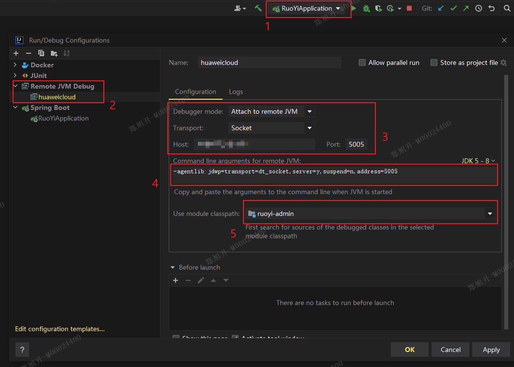
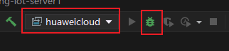

# IDEA远程debug docker容器

### IDEA配置

### 编写dockerfile
```dockerfile
# 重点在于 "-agentlib:jdwp=transport=dt_socket,server=y,suspend=n,address=5005"
ENTRYPOINT ["java","-Djava.security.egd=file:/dev/./urandom","-Duser.timezone=GMT+8","-agentlib:jdwp=transport=dt_socket,server=y,suspend=n,address=5005","-jar","/ruoyi.jar"]
```
### 运行测试
1. 容器启动后，IDEA选择指定配置项启动。

2. 打断点测试